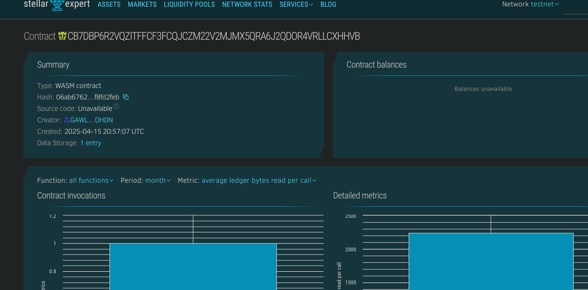

## 📘 Project Title  
**Digital Certificate Verifier**

---

## 📄 Project Description  
Digital Certificate Verifier is a decentralized application built on the blockchain to issue, store, and verify academic and professional certificates. This system ensures tamper-proof certification and provides transparent verification, eliminating fraud in credential management.

---

## 🎯 Project Vision  
To create a trustless and transparent ecosystem where educational and professional certificates can be verified instantly and securely by anyone, from anywhere in the world, without relying on centralized authorities.

---

## 🚀 Key Features  
- **Blockchain-backed Verification**: Certificates are hashed and stored immutably on-chain.  
- **Instant Credential Validation**: Employers or institutions can verify credentials in real time.  
- **Decentralized Certificate Issuance**: Institutions can issue certificates securely using smart contracts.  
- **User Privacy**: Only proof of certificate (hash) is stored on-chain, preserving personal data.  
- **Scalability**: Supports multiple issuers and certificate types.

---

## 🔮 Future Scope  
- Integration with educational platforms (e.g., Coursera, Udemy, etc.)  
- Cross-chain certificate support for interoperability  
- Zero-knowledge proof-based private verification  
- Mobile app for on-the-go certificate access and validation  
- NFT-based certificates for transferable skills and recognitions  

---

## Contract Details
CB7DBP6R2VQZITFFCF3FCQJCZM22V2MJMX5QRA6J2QDOR4VRLLCXHHVB
